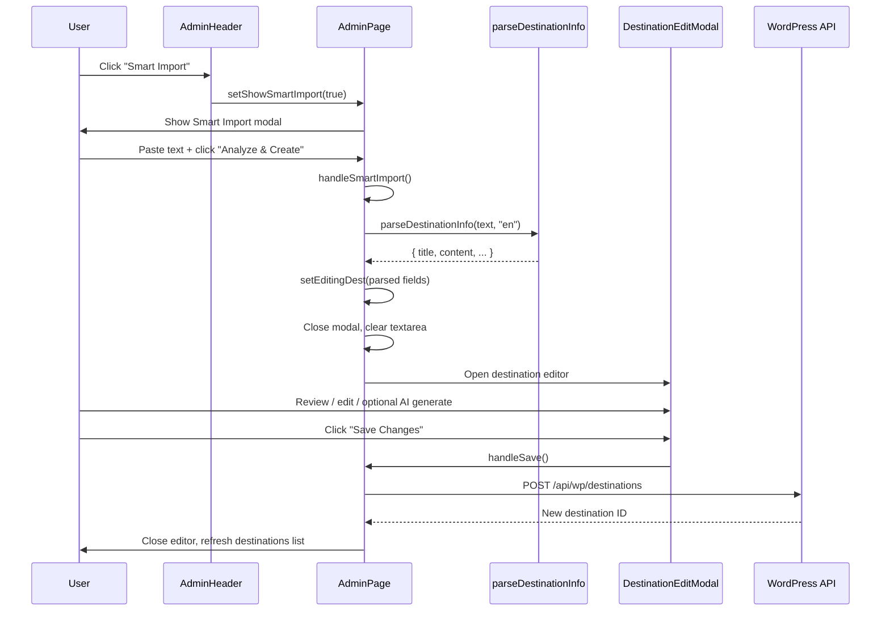

# Smart Import — Destinations

This document describes what happens when an admin clicks **Smart Import** on the Destinations tab in the WordPress admin UI.

## Where the button lives

The **Smart Import** button appears in the admin header only when the **Destinations** tab is active.

| File | Role |
|------|------|
| `src/wp/AdminHeader.tsx` | Renders the button and calls `onSmartImport` on click |
| `src/wp/admin.tsx` | Owns state, the modal, and all import/save logic |

```tsx
// AdminHeader.tsx — button click
onClick={onSmartImport}

// admin.tsx — handler passed to AdminHeader
onSmartImport={() => setShowSmartImport(true)}
```

## End-to-end flow



## Step 1 — Open the modal

Clicking **Smart Import** sets `showSmartImport` to `true`. A full-screen overlay modal opens with:

- Title: **Smart Import** (with lightning icon)
- Subtitle: *"Turn any text into a destination in one click"*
- A large textarea for pasted content (hotel info, brochure text, website snippet, etc.)
- **Cancel** — closes the modal without changes
- **Analyze & Create** — starts the import (disabled while parsing or when textarea is empty)

Closing via **Cancel** or the **X** button only sets `showSmartImport` to `false`. No API calls are made.

## Step 2 — Analyze & Create (`handleSmartImport`)

When the user clicks **Analyze & Create**, `handleSmartImport` runs in `src/wp/admin.tsx`:

1. **Validation** — If the textarea is empty/whitespace, the function returns immediately.
2. **Loading state** — `isParsing` is set to `true`. The button shows a spinner and the label **Analyzing...**
3. **Parse text** — Calls `parseDestinationInfo(importText, "en")` from `src/services/geminiApi.ts`.
4. **Populate editor** — On success, builds a partial `Destination` object and stores it in `editingDest`:

   | Field | Source |
   |-------|--------|
   | `title.rendered` | `parsed.title` |
   | `content.rendered` | `parsed.content` (or `""`) |
   | `destination_name` | `parsed.title` |
   | `destination_region` | `parsed.destination_region` (or `""`) |
   | `destination_country` | `parsed.destination_country` (or `""`) |

5. **Close import modal** — `showSmartImport` → `false`, `importText` is cleared.
6. **Error handling** — On failure, an `alert()` shows the error message. The modal stays open so the user can retry.
7. **Cleanup** — `isParsing` is reset to `false`.

### What `parseDestinationInfo` does today

Current implementation in `src/services/geminiApi.ts` is a lightweight text parser (not a live Gemini call):

```ts
// First non-empty line → title
// Full trimmed pasted text → content
return {
  title: firstLine || "New Destination",
  content: text.trim(),
};
```

So **region** and **country** are not extracted during Smart Import unless that function is extended. The UI copy suggests AI analysis, but the current code only splits the first line from the body.

## Step 3 — Destination editor opens

Because `editingDest` is now set, `DestinationEditModal` renders automatically (`src/wp/DestinationEditModal.tsx`).

The user sees a pre-filled **Add New Destination** form with:

- Destination name (from parsed title)
- Content (full pasted text)
- Empty optional fields: identifier, type, region, country, Farsi fields, etc.

### Optional — AI Assistant

Before saving, the user can:

1. Toggle which fields to auto-generate (content, region, country, Farsi fields, etc.)
2. Click **Generate with AI** → calls `generateDestinationContent()` in `geminiApi.ts`
3. Selected fields are merged into the form via `updateField()`

This step is independent of Smart Import; it runs only if the user clicks **Generate with AI**.

## Step 4 — Save to WordPress

When the user submits the form (**Save Changes**), `handleSave` runs:

1. **Create vs update** — Smart Import always creates a new destination (no `id` on `editingDest`), so it calls `createDestination()`.
2. **API request** — `POST /api/wp/destinations` with the full destination payload (`src/services/destinationApi.ts`).
3. **Server** — `server.ts` maps the body to WordPress:
   - **Core post fields:** `title`, `content`, `status: "publish"`
   - **ACF/custom fields:** `destination_name`, `destination_identifier`, `type_of_destination`, region/country (EN + Farsi), `destination_region_description_farsi`, optional `destination_photo`
4. **Success** — New destination is prepended to the local list, editor closes (`editingDest` → `null`).
5. **Failure** — Alert with `Save failed: <message>`.

Requires `WP_USERNAME` and `WP_APP_PASSWORD` in the environment for write access.

## State reference

| State | Purpose |
|-------|---------|
| `showSmartImport` | Controls Smart Import modal visibility |
| `importText` | Textarea content |
| `isParsing` | Loading flag during analyze step |
| `editingDest` | Drives Destination Edit Modal; non-null after successful import |
| `isSaving` | Loading flag during WordPress save |
| `isGenerating` | Loading flag during optional AI generation |
| `selectedAIFields` | Which fields AI generation should fill (default: `["content"]`) |

## Related flows (not Smart Import)

These are separate entry points on other tabs:

| Tab | Button | Modal / action |
|-----|--------|----------------|
| Destinations | **Add New Destination** | Opens empty `DestinationEditModal` |
| Tickets | **Import as Destination** | Pre-fills editor from ticket data (`handleQuickImportTicket`) |
| Accommodations | **JSON Import** | `AccommodationJsonImportModal` |
| Travel Offers | **Create from URL** | `TravelOfferUrlModal` |

## Key files

```
src/wp/admin.tsx              — Smart Import modal, handleSmartImport, save flow
src/wp/AdminHeader.tsx        — Smart Import button (Destinations tab only)
src/wp/DestinationEditModal.tsx — Post-import editor + AI assistant + save form
src/services/geminiApi.ts     — parseDestinationInfo, generateDestinationContent
src/services/destinationApi.ts — createDestination / updateDestination
server.ts                     — POST/PUT /api/wp/destinations → WordPress
```
